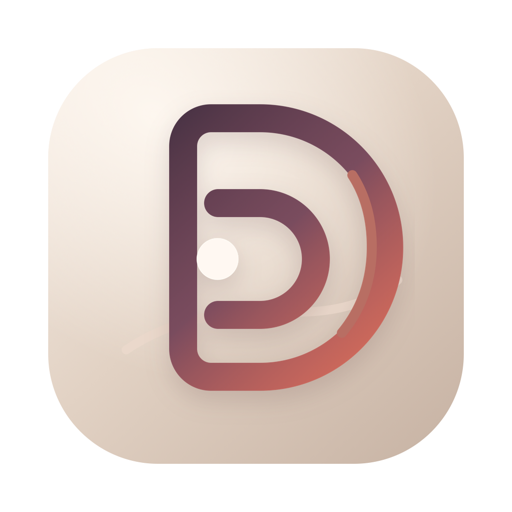
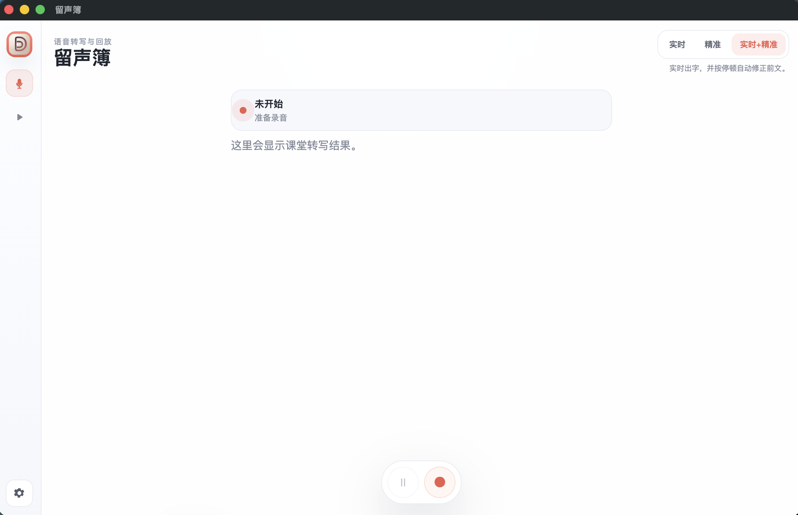

<p align="center">
  
</p>

<h1 align="center">留声簿</h1>

<p align="center">一款面向 macOS 的语音转写与回放工作台。</p>

<p align="center">
  <a href="https://github.com/renshaojie233/liushengbu/releases/latest">
    
  </a>
  <a href="./LICENSE">
    
  </a>
  
  
</p>

## 概览

留声簿用于把语音内容变成可读、可回放、可导出的文字记录。它支持现场录音、导入音频、实时转写、精准优化、历史记录检索、按段跳转回放，以及一键导出转写稿与音频文件。

对于普通用户，首次使用只需要做两件事：

1. 开启麦克风权限
2. 在设置中填写豆包语音的 `App ID`、`Access Token`、`Secret Key`

## 界面预览



## 功能一览

- `🎙️ 实时录音`：点击底部主按钮即可开始或停止录音
- `⚡ 实时转写`：低延迟出字，适合会议或访谈时边说边记
- `🧠 精准优化`：支持整段高质量重转写，适合导出前精修
- `🌓 三种模式`：`实时`、`精准`、`实时+精准`
- `🔎 本地搜索`：可按标题、全文与分段内容检索历史记录
- `✍️ 记录管理`：支持重命名、删除、导出
- `⏯️ 按段回放`：点击任意分段即可跳到对应录音位置
- `📦 开箱即用`：安装包内置 `ffmpeg`，无需再装外部依赖

## 适用场景

- 会议记录
- 采访整理
- 语音备忘
- 课程或分享记录
- 需要边听边回放边校对的语音内容整理

## 下载与安装

普通用户直接从 GitHub Releases 下载 `.dmg` 即可：

- [下载最新版本](https://github.com/renshaojie233/liushengbu/releases/latest)

安装步骤：

1. 下载 `liushengbu-*.dmg`
2. 双击打开安装包
3. 将 `留声簿.app` 拖入“应用程序”
4. 从“应用程序”中启动 `留声簿`

## 首次使用

### 1. 开启麦克风权限

录音前需要给 `留声簿` 开启麦克风权限。

系统路径：

`系统设置 -> 隐私与安全性 -> 麦克风`

如果权限未开启，应用会主动弹出提示，并可引导你直接跳到系统设置。

### 2. 填写豆包语音配置

打开应用左下角的“设置”，填写以下 3 项：

- `App ID`
- `Access Token`
- `Secret Key`

在大多数使用同一套豆包语音接口的场景下，普通用户只需要填写这 3 项。其余高级参数已经给出默认值，通常不需要修改。

## 使用说明

### 录音转写

1. 打开应用
2. 确认麦克风权限已开启
3. 在设置中填好豆包语音的 3 个参数
4. 在右上角选择模式
5. 点击底部主按钮开始录音
6. 再次点击主按钮停止录音

三种模式说明：

- `实时`：优先低延迟，边说边出字
- `精准`：停止后生成高质量稿
- `实时+精准`：实时出字，并按停顿自动修正前文

### 回放与校对

1. 切换到左侧“回放”模式
2. 选择一条历史录音
3. 点击任意分段文字，可跳到对应录音位置
4. 使用下方播放器回放整段内容

### 优化整段转写

在回放模式中，打开某条记录后，点击 `优化转写` 即可重新跑一次整段高质量识别。

适合这些场景：

- 想获得更稳定的整段结果
- 对实时稿还不满意
- 需要导出前再精修一次

### 导入本地音频

在回放模式点击 `导入音频`，选择本地音频文件后即可开始处理。

### 导出

导出会生成一个文件夹，里面包含：

- 转写稿 `.md`
- 原始录音文件
- 便于播放的 `MP3`

## 搜索、命名与记录管理

- 左侧支持按标题、全文和分段内容搜索
- 每条记录都可以直接重命名
- 每条记录都支持删除
- 所有记录默认保存在本地，不依赖云端数据库

## 终端用户是否需要额外安装依赖

不需要。

当前安装包已经内置：

- `ffmpeg`

所以普通用户安装后，不需要再手动安装 Homebrew 或 `ffmpeg`。

用户侧仍然需要的只有：

- 可用的 macOS 麦克风权限
- 可用的豆包语音接口配置
- 正常联网

## 开发

### 开发环境

- Node.js 20+
- npm 10+
- macOS

### 本地启动

```bash
npm install
npm start
```

### 打包

生成目录版：

```bash
npm run build:dir
```

生成安装包：

```bash
npm run build:dmg
```

生成完整发布产物：

```bash
npm run build
```

## 项目结构

```text
.
├── assets/            图标与界面资源
├── build/             打包与 entitlement 配置
├── docs/              README 预览素材
├── lib/               转写、存储、ffmpeg 等核心逻辑
├── scripts/           开发辅助脚本
├── index.html         界面骨架
├── styles.css         样式
├── renderer.js        前端交互与页面逻辑
├── preload.js         Electron 安全桥接
├── main.js            主进程与本地能力入口
└── package.json
```

## 隐私说明

- 录音记录默认保存在本机
- 应用本身不内置任何可用的豆包密钥
- 需要用户自行在设置中填写自己的接口参数
- 实际语音识别请求会发送到你配置的豆包语音服务

## 常见问题

### 为什么第一次录音前会弹麦克风权限提示？

因为 macOS 必须由用户明确授权麦克风访问。

### 为什么我只需要填 3 个参数？

因为常用的高级参数已经内置为默认值。普通使用场景下，用户只需要填写：

- `App ID`
- `Access Token`
- `Secret Key`

### 为什么安装包体积不算小？

因为项目目前基于 Electron 构建，同时安装包内置了 `ffmpeg`，所以体积会明显大于原生小工具。

## 许可证

本项目使用 [MIT License](./LICENSE)。
